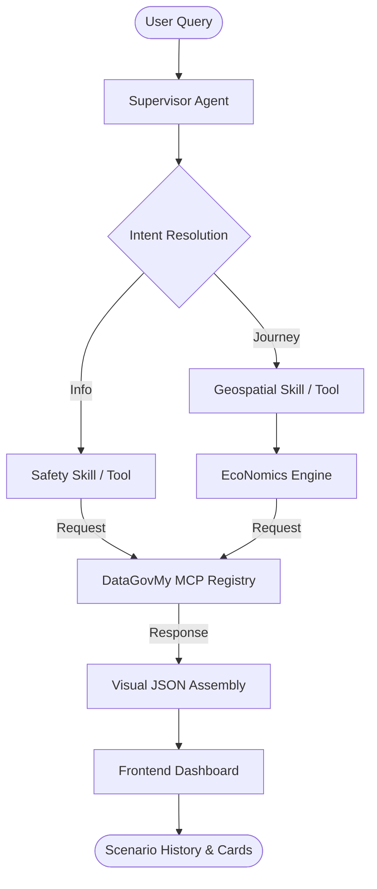

# 🏙️ TransitFlow 🇲🇾

**The Intelligent Subsidy & Mobility Advisor for a Resilient Malaysia.**

TransitFlow is a multi-agent AI system designed to navigate the economic and environmental complexities of modern Malaysian urban life. It integrates state-of-the-art **Geospatial Reasoning**, **Real-time National Safety Data**, and the **BudiProtocol Economics Engine.**

---

## 🚀 Key Features

-   **⛈️ Safety-First Routing**: Integrated with live **DataGovMy** meteorological telemetry to provide real-time flood and weather briefings on every journey query.
*   **🗑️ Clear History (NEW)**: Secure, one-click reset for both local browser state and persistent server-side agent memory, ensuring a fresh start for every journey.
*   **📍 Diverse Proximity (NEW)**: Intelligent station discovery that prioritizes variety (KTM, LRT, MRT) and eliminates duplicates within a 10km radius.
-   **💰 BudiProtocol Engine**: A dynamic economics simulator that calculates the savings between the **Market Fuel Rate** (RM 3.87) and the **Budi95 Subsidized Rate** (RM 2.05).
-   **🚆 Multi-Modal Optimization**: Direct comparison of Car, Motorbike, E-Hailing (Grab), and Public Transit (LRT/MRT/Bus) in a clean executive briefing.

---

## 🛠️ Technical Architecture & Stack

TransitFlow is powered by the **TransitFlow "Kinetic" Engine**, a high-resilience, multi-agent AI framework designed for national-scale production.

### 🔄 Process Flow

### 🏛️ Production-Grade Hardening
*   **🔐 Secret Management**: 100% integration with **Google Cloud Secret Manager**. All sensitive credentials (DB, API Keys, Firebase) are pulled dynamically, eliminating local `.env` risks in production.
*   **🏢 Database (Cloud SQL)**: Geospatial proximity logic powered by **PostgreSQL (PostGIS/Earthdistance)** with tactical JSON fallbacks for extreme resilience.
*   **🖥️ Windows Compatibility**: ASCII-hardened logging system to ensure stability across both Windows development and Linux production environments.

### 🧱 Core Technologies
-   **AI Core**: **Vertex AI (Gemini 2.5 Flash Lite)** orchestrated via the **Google Agentic Development Kit (ADK)**.
-   **Communication**: **Model Context Protocol (MCP)** via **FastMCP** for decoupled, resilient tool-calling.
-   **Backend**: **Python 3.12 (FastAPI)** deployed on **Google Cloud Run**.
-   **Frontend**: Professional Vanilla JS/HTML5/CSS3 dashboard with real-time GPS telemetry.

---

## 🏛️ ADK Orchestration Detail

TransitFlow utilizes the **ADK `Runner`** to maintain session persistence and tool-calling integrity. 
- **Supervisor Agent**: A single `TransitFlowSupervisor` acts as the primary reasoning node.
- **Skill Injection**: Instead of high-latency subagents, we utilize **Atomic Tool Injection** where specialized "Skills" (Geospatial, Economics, Meteorological) are injected directly into the Supervisor's toolbelt via the ADK.
- **Memory Persistence**: Per-user session memory stored in a high-resilience registry with support for targeted purging (Clear History).

---

## 📈 Impact & Scalability

By choosing a **Serverless Multi-Agent Architecture** backed by **FastAPI** and **FastMCP**, TransitFlow ensures low-latency safety advice even during high-concurrency events (e.g., flash flood alerts). The **MCP-based design** allows for immediate expansion of data sources without refactoring the core reasoning logic.

---

**Production URL**: [https://transitflow-kinetic-4dcycqsk3q-uc.a.run.app](https://transitflow-kinetic-4dcycqsk3q-uc.a.run.app)

*Built with ❤️ in Malaysia. Powered by **Google Gemini** and the **Google Cloud Stack**.* 🇲🇾🚆🎬📈
