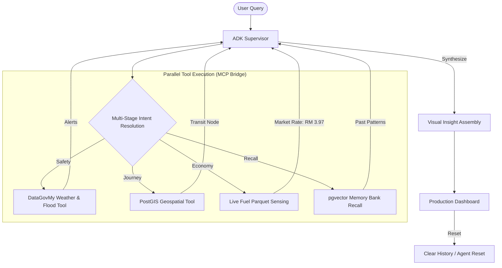

# 🚆 TransitFlow "Kinetic" 🇲🇾
**The Resilient, ADK-powered National Mobility & Economy Advisor.**

TransitFlow "Kinetic" is a high-resilience production agent designed to act as a **National Economic & Safety Shield**. Built on the **Google Agentic Development Kit (ADK)** and bridged with live national registries via **MCP**, TransitFlow protects Malaysian commuters from global fuel volatility (RM 3.97) and unpredictable flash floods.

---

## 🚀 Phase 2 "Kinetic" Upgrades

*   **⚡ Gemini 3.1 Flash Lite**: Upgraded to the latest 3.1 series for lower latency and higher reasoning precision.
*   **🧠 Agentic Memory Bank (NEW)**: Long-term persistent memory powered by **CloudSQL + pgvector**. TransitFlow now remembers user journey patterns and preferences across sessions for hyper-personalized safety advice.
*   **💰 Live Economics Sensing**: Dynamically fetches current market fuel rates (RM 3.97) via the **DataGovMy MCP Bridge**.
*   **🗑️ Clear History (NEW)**: Secure, one-click reset for local browser state and the persistent **Memory Bank**, ensuring a fresh start for every journey.
*   **📍 Diverse Proximity (NEW)**: Intelligent station discovery that prioritizes modal variety (KTM, LRT, MRT).
*   **🔐 Production Security**: 100% integration with **Google Cloud Secret Manager**.

---

## 🚀 Key Features

-   **⛈️ Safety-First Routing**: Integrated with live **DataGovMy** meteorological telemetry for real-time flood and weather briefings.
-   **💰 BudiSavings Shield**: A dynamic economics simulator that calculates the savings between the **Market Fuel Rate** (RM 3.97) and the **Budi95 Subsidized Rate** (RM 2.05).
-   **🚆 Multi-Modal Optimization**: Direct comparison of Car, Motorbike, E-Hailing (Grab), and Public Transit (LRT/MRT/Bus).

---

## 🛠️ Technical Architecture & Stack

TransitFlow is powered by the **TransitFlow "Kinetic" Engine**, a high-resilience, multi-agent AI framework designed for national-scale production.

### 🔄 Process Flow

### 🏛️ Production-Grade Hardening
*   **🔐 Secret Management**: 100% integration with **Google Cloud Secret Manager**.
*   **🏢 Database (Cloud SQL)**: Geospatial proximity logic powered by **PostgreSQL (PostGIS)** and semantic search via **pgvector**.
*   **🖥️ Windows First**: ASCII-hardened logging system ensuring stability across local Windows dev and Linux production.

---

## ⚖️ License

TransitFlow is licensed under the **Polyform Noncommercial License 1.0.0**. See the [LICENSE](LICENSE) file for details.

---

**Production URL**: [https://transitflow-kinetic-4dcycqsk3q-uc.a.run.app](https://transitflow-kinetic-4dcycqsk3q-uc.a.run.app)

*Built with ❤️ in Malaysia. Powered by **Google Gemini** and the **Google Cloud Stack**.* 🇲🇾🚆🎬📈
