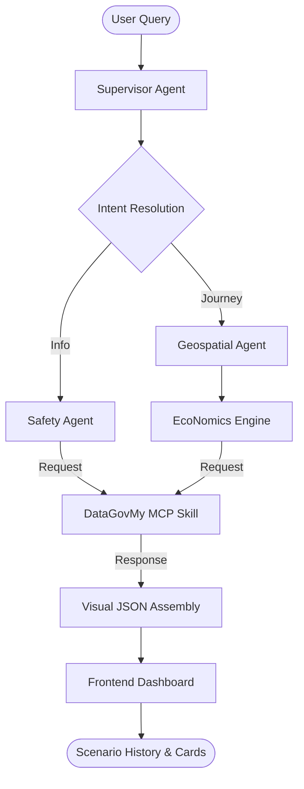
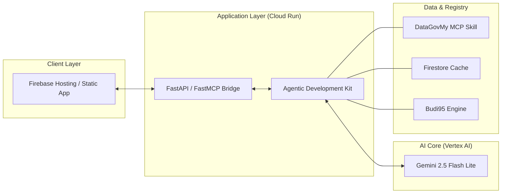

# 🏙️ TransitFlow 🇲🇾

**The Intelligent Subsidy & Mobility Advisor for a Resilient Malaysia.**

TransitFlow is a multi-agent AI system designed to navigate the economic and environmental complexities of modern Malaysian urban life. It integrates state-of-the-art **Geospatial Reasoning**, **Real-time National Safety Data**, and the **BudiProtocol Economics Engine.**

---

## 🚀 Key Features

-   **⛈️ Safety-First Routing**: Integrated with live **DataGovMy** meteorological telemetry to provide real-time flood and weather briefings on every journey query.
-   **💰 BudiProtocol Engine**: A dynamic economics simulator that calculates the savings between the **Market Fuel Rate** (RM 3.87) and the **Budi95 Subsidized Rate** (RM 2.05).
-   **🚆 Multi-Modal Optimization**: Direct comparison of Car, Motorbike, E-Hailing (Grab), and Public Transit (LRT/MRT/Bus) in a clean executive briefing.
-   **🧩 Scenario Navigator**: High-resilience frontend that flips between primary routes and nearest "Transit Hub" alternates to find the most economical journey.

---

## 🛠️ Technical Architecture & Stack

TransitFlow is powered by a high-resilience, multi-agent AI framework designed for national-scale production.

### 🔄 Process Flow

### 🏛️ System Design

-   **AI Core**: **Vertex AI (Gemini 2.5 Flash Lite)** orchestrated via the Google Agentic Development Kit (ADK).
-   **Communication Protocol**: **Model Context Protocol (MCP)** via **FastMCP** for decoupled, resilient tool-calling.
-   **Backend Engine**: **Python 3.12 (FastAPI)** deployed on **Google Cloud Run** for serverless auto-scaling.
-   **Frontend**: Professional Vanilla JS/HTML5/CSS3 dashboard hosted on **Firebase**.
-   **Registry Layer**: Real-time integration with the Malaysia Open Data registry (DataGovMy).

---

## 📈 Impact & Scalability

By choosing a **Serverless Multi-Agent Architecture** backed by **FastAPI** and **FastMCP**, TransitFlow ensures low-latency safety advice even during high-concurrency events (e.g., flash flood alerts). The **MCP-based design** allows for immediate expansion of data sources (e.g., adding TNB outages or SPAD arrivals) without refactoring the core reasoning logic.

---

*Built with ❤️ in Malaysia. Powered by **Google Gemini** and the **Google Cloud Stack**.* 🇲🇾🚆🎬📈
