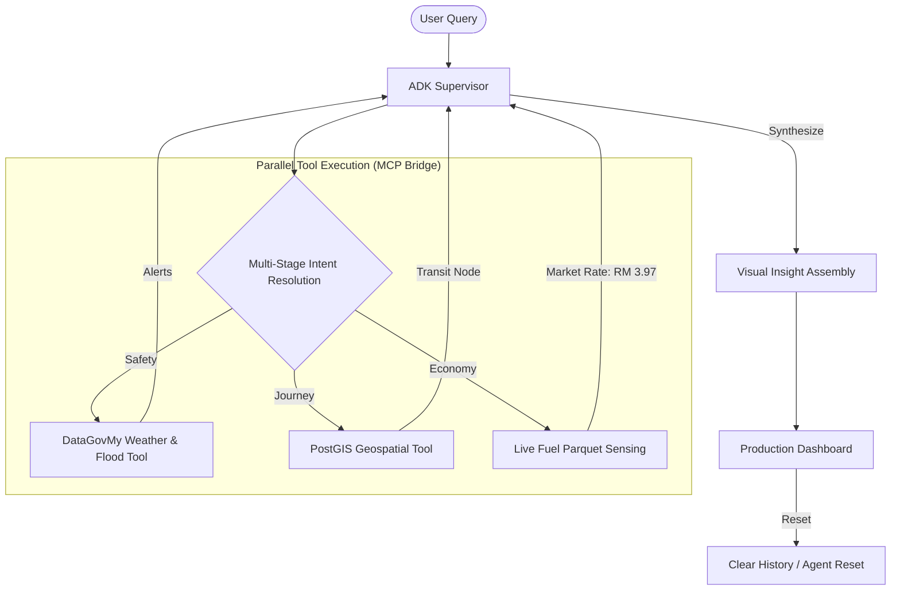

# 🚆 TransitFlow "Kinetic" 🇲🇾
**The Resilient, ADK-powered National Mobility & Economy Advisor.**

TransitFlow "Kinetic" is a high-resilience production agent designed to act as a **National Economic & Safety Shield**. Built on the **Google Agentic Development Kit (ADK)** and bridged with live national registries via **MCP**, TransitFlow protects Malaysian commuters from global fuel volatility (RM 3.97) and unpredictable flash floods.

---

## 🚀 Phase 2 "Kinetic" Upgrades

*   **⚡ Gemini 3.1 Flash Lite**: Upgraded to the latest 3.1 series for lower latency and higher reasoning precision during journey orchestration.
*   **💰 Live Economics Sensing**: Dynamically fetches current market fuel rates (RM 3.97) via the **DataGovMy MCP Bridge** (Live Parquet Parsing).
*   **🗑️ Clear History (NEW)**: Secure, one-click reset for local browser state and persistent server-side agent memory, ensuring a fresh start for every journey.
*   **📍 Diverse Proximity (NEW)**: Intelligent station discovery that prioritizes modal variety (KTM, LRT, MRT) and eliminates duplicates within a 10km radius.
*   **🔐 Production Security**: 100% integration with **Google Cloud Secret Manager** for zero-leak credential isolation in production Cloud Run environments.

---

## 🚀 Key Features

-   **⛈️ Safety-First Routing**: Integrated with live **DataGovMy** meteorological telemetry to provide real-time flood and weather briefings on every journey query.
-   **💰 BudiSavings Shield**: A dynamic economics simulator that calculates the savings between the **Market Fuel Rate** (RM 3.97) and the **Budi95 Subsidized Rate** (RM 2.05).
-   **🚆 Multi-Modal Optimization**: Direct comparison of Car, Motorbike, E-Hailing (Grab), and Public Transit (LRT/MRT/Bus) in a clean executive briefing.

---

## 🛠️ Technical Architecture & Stack

TransitFlow is powered by the **TransitFlow "Kinetic" Engine**, a high-resilience, multi-agent AI framework designed for national-scale production.

### 🔄 Process Flow

### 🏛️ Production-Grade Hardening
*   **🔐 Secret Management**: 100% integration with **Google Cloud Secret Manager**. All sensitive credentials (DB, API Keys, Firebase) are pulled dynamically.
*   **🏢 Database (Cloud SQL)**: Geospatial proximity logic powered by **PostgreSQL (PostGIS)** for high-precision station matching.
*   **🖥️ Windows First**: ASCII-hardened logging system ensuring stability across both local Windows development and Linux Cloud Run production.

### 🧱 Core Technologies
-   **AI Core**: **Vertex AI (Gemini 3.1 Flash Lite)** orchestrated via the **Google Agentic Development Kit (ADK)**.
-   **Communication**: **Model Context Protocol (MCP)** via **FastMCP** for decoupled, resilient tool-calling.
-   **Backend**: **Python 3.12 (FastAPI)** deployed on **Google Cloud Run**.
-   **Frontend**: Professional Vanilla JS/HTML5/CSS3 dashboard with real-time GPS telemetry.

---

## 🏛️ ADK Orchestration Detail

TransitFlow utilizes the **ADK `Runner`** to maintain session persistence and tool-calling integrity. 
- **Supervisor Agent**: A single `TransitFlowSupervisor` acts as the primary reasoning node.
- **Skill Injection**: Specialized "Skills" (Geospatial, Economics, Meteorological) are injected directly into the Supervisor's toolbelt via the ADK.
- **Memory Persistence**: Per-user session memory stored in a high-resilience registry with support for targeted purging (Clear History).

---

## 📈 Impact & Scalability

By choosing a **Serverless Multi-Agent Architecture** backed by **FastAPI** and **FastMCP**, TransitFlow ensures low-latency safety advice even during high-concurrency events. The **MCP-based design** allows for immediate expansion of data sources (e.g., live Prasarana feeds) without refactoring the core reasoning logic.

---

**Production URL**: [https://transitflow-kinetic-4dcycqsk3q-uc.a.run.app](https://transitflow-kinetic-4dcycqsk3q-uc.a.run.app)

*Built with ❤️ in Malaysia. Powered by **Google Gemini** and the **Google Cloud Stack**.* 🇲🇾🚆🎬📈
